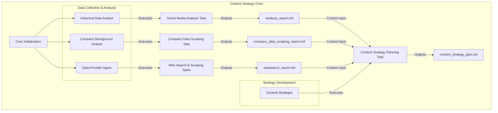
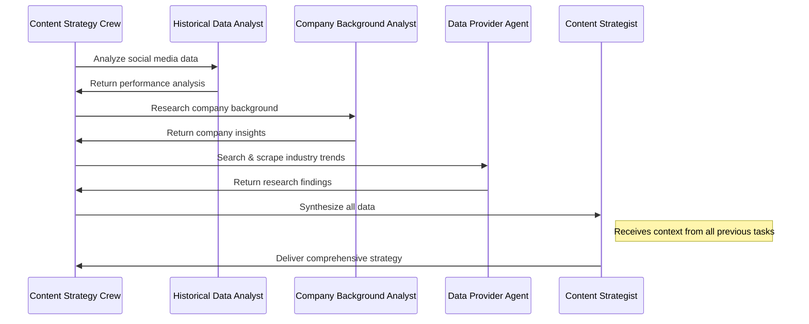

# Content Strategy Crew by KSRX

A powerful AI-powered content strategy system built with [crewAI](https://crewai.com) that orchestrates multiple specialized AI agents to analyze data, research trends, and develop comprehensive content strategies.


## Overview

The Content Strategy Crew automates the entire content planning process through a collaborative workflow where data flows from specialized agents to a central strategist:



## How It Works

The system follows a sequential process where:

1.  The Historical Data Analyst examines past social media performance.
2.  The Company Background Analyst researches your company's profile.
3.  The Data Provider Agent gathers current industry trends.
4.  The Content Strategist synthesizes all this information to create a comprehensive strategy.

All data from the first three agents flows into the Content Strategist, who then creates a unified content strategy plan based on this collective intelligence.

## Installation

Ensure you have Python >=3.10 <3.13 installed on your system.

```bash
# Install dependencies
pip install -r requirements.txt

# Or using UV
pip install uv
crewai install
```

## Configuration

1.  Add your API keys to the `.env` file:

    ```
    OPENAI_API_KEY=your_openai_api_key
    SERPER_API_KEY=your_serper_api_key
    AGENTOPS_API_KEY=your_agentops_api_key
    MONGODB_URI=your_mongodb_uri
    ```

2.  Prepare your data:
    -   Place your social media analytics CSV file at `data1.csv`
3.  Customize agent and task configurations in the YAML files:
    -   `config/agents.yaml`: Define agent roles and goals
    -   `config/tasks.yaml`: Customize task descriptions and outputs

## Usage

You can run the Content Strategy Crew in two ways:

1.  Using the run script:

    ```bash
    ./run.sh
    ```

    This script will create a virtual environment, install dependencies, and start the FastAPI application.

2.  Access the frontend:

    Open your browser and navigate to `http://localhost:8000/`. You should see the frontend.

3.  Interact with the API:

    Fill in the form fields and click "Execute Crew". The output from the API will be displayed in the `outputContent` section, and real-time updates will be shown in the `Updates` section.

The system will generate output files in the `./output/` directory:

-   `analysis_report.md`: Social media performance analysis
-   `company_data_scraping_report.md`: Company background research
-   `websearch_report.md`: Industry trends and competitor analysis
-   `content_strategy_plan.md`: Final comprehensive content strategy

## API Endpoints

The FastAPI application provides the following endpoints:

-   `POST /execute_crew`: Execute the Content Strategy Crew
-   `GET /health`: Check the health status of the application and MongoDB connection
-   `GET /history`: Retrieve all execution history entries
-   `GET /history/{session_id}`: Retrieve a specific execution history entry
-   `DELETE /history/{session_id}`: Delete a specific execution history entry
-   `GET /`: Serves the main HTML file for the frontend

## Real-time Updates

The frontend displays real-time updates on which agent is running which task. This allows you to monitor the progress of the crew execution.

## Displaying Markdown Output

The frontend uses `marked.js` to parse the Markdown content and render it as HTML, providing a formatted and readable output.

## Next.js Frontend

A modern Next.js frontend is also available in the `ccagent-frontend` directory. To use it:

```bash
cd ccagent-frontend
npm install
npm run dev
```

Then navigate to `http://localhost:3000` to access the improved user interface with tabs for updates and output, plus a history view of previous executions.

## Key Implementation Note

To ensure the Content Strategist receives all data from previous tasks, make sure to configure the context properly:

```python
@task
def content_strategy_planning(self) -> Task:
    return Task(
        config=self.tasks_config['content_strategy_planning'],
        context=[
            self.social_media_analysis(),
            self.company_data_scraping(),
            self.website_scraping()
        ],
        output_file='./output/content_strategy_plan.md'
    )
```

This ensures that all the outputs from previous tasks flow into the Content Strategist, allowing for a truly integrated strategy.

## Process Flow



## MongoDB Integration

The application now includes MongoDB integration for storing execution logs and outputs. Make sure to set the `MONGODB_URI` in your `.env` file.

## CORS Support

The API now supports Cross-Origin Resource Sharing (CORS) to allow requests from the frontend.

## Creator

This project was created by Kaviru Hapuarachchi.

-   Website: [kaviru.cc](https://kaviru.cc)
-   Email: [hello@kaviru.cc](mailto:hello@kaviru.cc)
-   GitHub: [@Kavirubc](https://github.com/Kavirubc)
