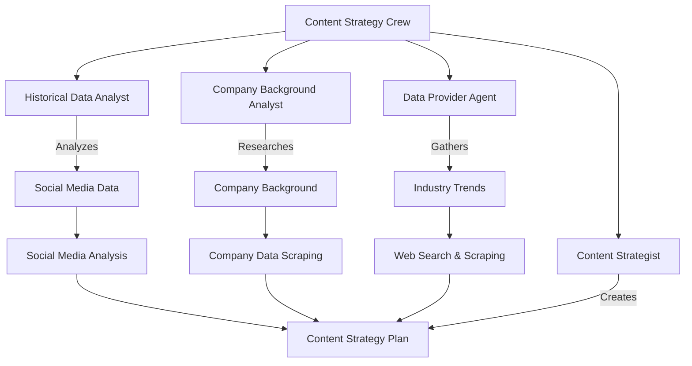
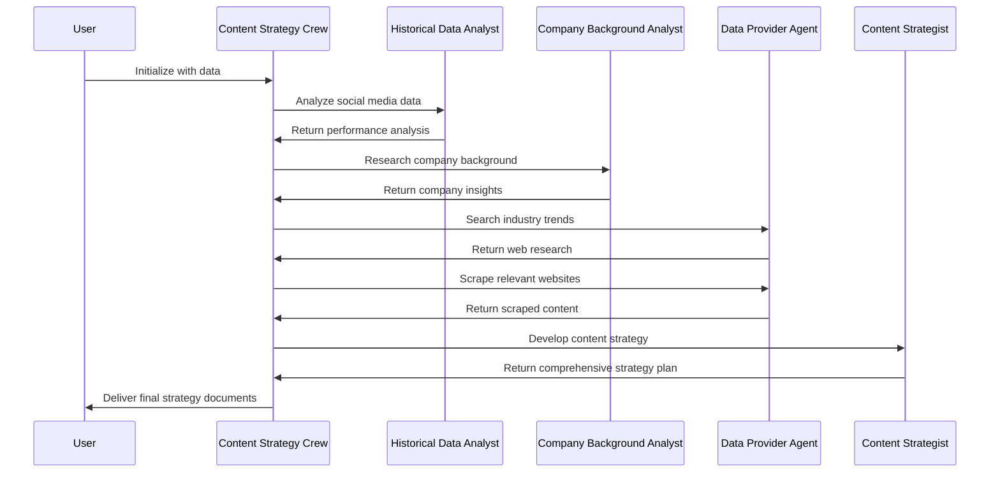

# Content Strategy Crew by KSRX

A powerful AI-powered content strategy system built with [crewAI](https://crewai.com). This project orchestrates multiple specialized AI agents to analyze data, research industry trends, and develop comprehensive content strategies for your business.

## Overview

The Content Strategy Crew automates the entire content planning process by:

1. Analyzing historical social media performance data
2. Researching company background and industry trends
3. Scraping relevant web content
4. Generating a data-driven content strategy plan



## Features

- **Data-Driven Analysis**: Analyzes CSV data of past social media performance to identify patterns and opportunities
- **Web Research**: Automatically searches for and analyzes industry trends and competitor strategies
- **Company Background Analysis**: Researches your company's history, mission, and values to ensure brand alignment
- **Comprehensive Strategy**: Generates a complete content strategy with specific recommendations for content types, platforms, and scheduling


## Installation

Ensure you have Python >=3.10 <3.13 installed on your system. This project uses [UV](https://docs.astral.sh/uv/) for dependency management.

```bash
# Install UV (if not already installed)
pip install uv

# Install dependencies
crewai install
```


## Configuration

1. Add your API keys to the `.env` file:

```
OPENAI_API_KEY=your_openai_api_key
SERPER_API_KEY=your_serper_api_key
AGENTOPS_API_KEY=your_agentops_api_key
```

2. Prepare your data:
    - Place your social media analytics CSV file at `data1.csv`
3. Customize agent and task configurations:
    - Modify `config/agents.yaml` to define agent roles and goals
    - Modify `config/tasks.yaml` to customize task descriptions and expected outputs

## Usage

Run the Content Strategy Crew with:

```bash
crewai run
```

The system will execute all tasks sequentially and generate output files in the `./output/` directory:

- `analysis_report.md`: Social media performance analysis
- `company_data_scraping_report.md`: Company background research
- `websearch_report.md`: Industry trends and competitor analysis
- `content_strategy_plan.md`: Final comprehensive content strategy


## How It Works




## Customization

- **Add New Data Sources**: Modify the `__init__` method in `ContentStrategyCrew` to include additional CSV tools
- **Extend Agent Capabilities**: Add new tools to agents in their respective methods
- **Create New Tasks**: Define new tasks in `tasks.yaml` and implement them in the `ContentStrategyCrew` class
- **Adjust Process Flow**: Change the `Process.sequential` parameter in the `crew` method to `Process.hierarchical` for more complex workflows


## Output

The final content strategy plan will include:

- Top-performing content types based on historical data
- Engagement patterns across different platforms
- Recommendations for content topics and formats
- Posting schedule and platform-specific strategies
- Brand voice and guideline implementation


## Creator

This project was created by Kaviru Hapuarachchi.

- Website: [kaviru.cc](https://kaviru.cc)
- Email: [hello@kaviru.cc](mailto:hello@kaviru.cc)
- GitHub: [@Kavirubc](https://github.com/Kavirubc)

If you have any questions or need assistance with this project, please don't hesitate to reach out!

## Support

For support with crewAI:

- Visit the [crewAI documentation](https://docs.crewai.com)
- Check out the [crewAI GitHub repository](https://github.com/joaomdmoura/crewai)
- [Join the crewAI Discord](https://discord.com/invite/X4JWnZnxPb)

